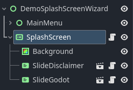
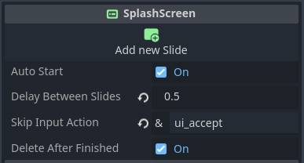
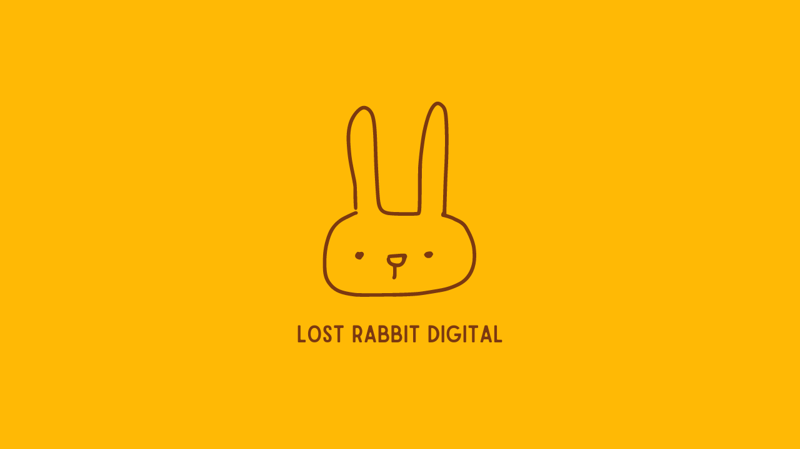

<div align="center">
  <h1>Spud Customs</h1>
</div>

<div align="center">
  
  <br>
  <h3>A dystopian document thriller game set in a world of anthropomorphic potatoes</h3>
  <p>
    <a href="https://store.steampowered.com/app/3291880/Spud_Customs/"></a>
    <a href="https://lost-rabbit-digital.itch.io/spud-customs"></a>
    
    
  </p>
</div>

## About The Game

**Spud Customs** is a dystopian document thriller inspired by "Papers, Please" but with a darkly humorous twist. Players take on the role of a customs officer at the Spudarado border, processing documents and making critical decisions while uncovering a deeper conspiracy involving the potato world.

In this world of anthropomorphic potatoes, your job is to:
- Verify potato passports and documents
- Enforce ever-changing immigration rules
- Make split-second decisions under time pressure
- Use missiles to prevent unauthorized border crossings
- Navigate moral choices and uncover the truth

## 🎮 Features

- **Document Processing System**: Examine passports for inconsistencies and rule violations
- **Dynamic Rule System**: New immigration rules each shift challenge your attention to detail
- **Border Runner System**: Stop unauthorized potatoes from crossing with air-to-surface missiles
- **Story Mode**: Experience a satirical narrative with multiple endings
- **Endless Mode**: Test your skills with progressively difficult challenges
- **Three Difficulty Levels**: Easy, Normal, and Hard modes for all skill levels
- **Steam Integration**: Achievements, leaderboards, and cloud saves

## 🖼️ Screenshots

<div align="center">
  
  
</div>

## 🚀 Getting Started

### Prerequisites

- [Godot Engine 4.0+](https://godotengine.org/download)
- [Git LFS](https://git-lfs.github.com/) (for handling large assets)

### Installation

```bash
# Clone the repository
git clone https://github.com/lost-rabbit-digital/spud-customs.git

# Change to project directory
cd spud-customs

# Pull LFS files
git lfs pull

# Open the project in Godot
godot -e
```

## 🏗️ Project Structure

```
spud-customs/
├── assets/              # Game assets (sprites, audio, etc.)
├── scenes/              # Game scenes
│   ├── main/            # Main game scenes
│   ├── ui/              # UI scenes
│   └── menus/           # Menu scenes
├── scripts/             # GDScript files
│   ├── core/            # Core game systems
│   ├── managers/        # Game managers
│   └── entities/        # Game entities
├── addons/              # Godot plugins
├── project_management/  # Project documentation and planning
└── export/              # Export configuration
```

## 🔧 Development

### Code Style

We follow the [GDScript style guide](https://docs.godotengine.org/en/stable/tutorials/scripting/gdscript/gdscript_styleguide.html) with the following additional conventions:

- Use `snake_case` for variables and functions
- Use `PascalCase` for classes and nodes
- Add descriptive comments for complex logic
- Group related variables and functions

### Branches

- `main` - Production-ready code
- `develop` - Development branch for upcoming releases
- `feature/X` - Feature branches
- `bugfix/X` - Bug fix branches

### Contribution Workflow

1. Fork the repository
2. Create your feature branch (`git checkout -b feature/amazing-feature`)
3. Commit your changes (`git commit -m 'Add some amazing feature'`)
4. Push to the branch (`git push origin feature/amazing-feature`)
5. Open a Pull Request

## 📝 Roadmap

- **Version 1.0.3** (In Development):
  - Visual Effects Improvements
  - Enhanced Feedback Systems
  - Minigame Expansion

- **Future Plans**:
  - Additional Shift Content
  - Localization Support
  - Mobile Adaptation
  - Potential Multiplayer Mode

See our [project board](https://github.com/lost-rabbit-digital/spud-customs/projects) for the full development roadmap.

## 📚 Documentation

- [Game Design Document](project_management/spud_customs_design_document.md)
- [Feature Implementation](project_management/new_features/)
- [Testing Procedures](project_management/testing/)

## 🔮 Steam Release

Spud Customs is available on [Steam](https://store.steampowered.com/app/3291880/Spud_Customs/). The full version includes:

- Complete story campaign
- Endless mode with global leaderboards
- Steam achievements
- Trading cards
- Cloud saves

## 📜 License

This project is licensed under the MIT License - see the [LICENSE](LICENSE) file for details.

## 👨‍💻 Team

- **David** - Developer & Project Lead - [GitHub](https://github.com/davidmfinol)
- **Lost Rabbit Digital Team** - [Website](https://lostrabbitdigital.com)

## 🌐 Community and Social Media

### Discord
- Join our community: [Lost Rabbit Digital](https://discord.gg/Y7ca8f7gBj)

### Bluesky
- [@BodenGameDev](https://bsky.app/profile/bodengamedev.bsky.social)
- [@BroHeart](https://bsky.app/profile/brohearttv.bsky.social)

## 🙏 Acknowledgements

- Special thanks to our [community contributors](project_management/user_feedback/special_thanks.md)
- [Godot Engine](https://godotengine.org/)
- [Papers, Please](https://papersplea.se/) for inspiration
- [Maaack's Godot Menus Template](https://github.com/Maaack/Godot-Menus-Template) - Menu system foundation
- All our players and testers

---

<div align="center">
  
  <p>Made with 🥔 by Lost Rabbit Digital</p>
</div>